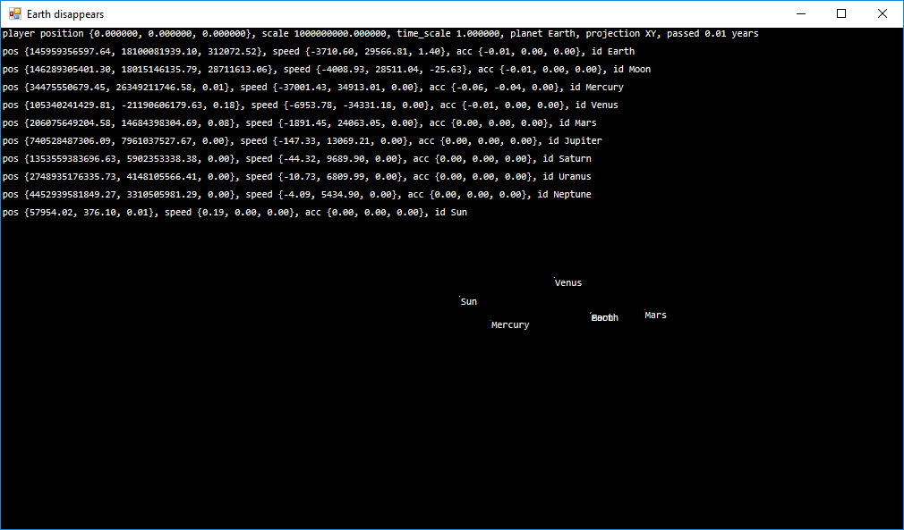

# Solar

Simple Solar System simulator written in F#.

## Screenshot

## Requirements

.NET (on Windows, I use 4.6.1) or mono (on Linux, I use Fedora 27, and macOS, where I did not test, and one person says that it does not work; I do not know why), F# (4.1), GNU Make (I use cygwin).

## Build

`make`.

## Run

`./main.exe solar_system.xml` or `mono main.exe solar_system.xml` on Linux and macOS.

## Controls

“W”, “A”, “S”, “D” – move, “+”, “-” – control time speed, “,”, “.” – control scale.
