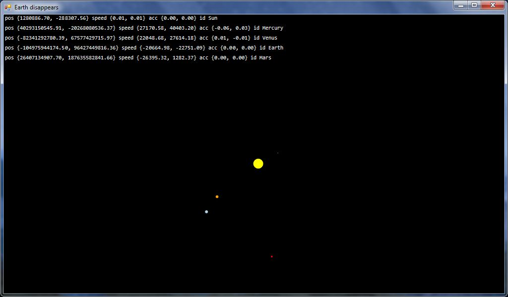

# Solar

Simple Solar System simulator written in F#.

## Screenshot

## Requirements

.NET (on Windows, I use 4.6.1) or mono (on Linux, I use Fedora 27, and macOS, where I did not test, and one person says that it does not work; I do not know why), F# (4.1), GNU Make (I use cygwin).

## Build

`make` or build binary: `make build-binary`.

## Run

`make run` or `fsi main.fsx`, or `./main.exe`/`mono main.exe`.
